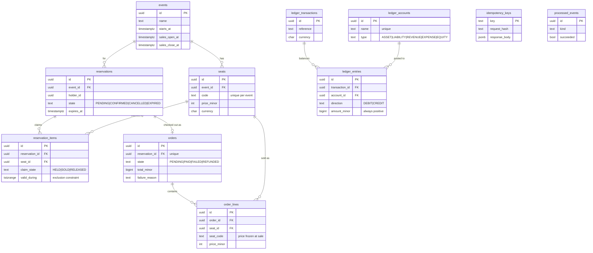

# Database schema & migrations

Postgres schema for the model in [`domain.md`](domain.md). Schema is declared
in `apps/api/src/shared/infrastructure/database/schema.ts` (Drizzle), migrations
live in `apps/api/migrations/`.

Drizzle Kit **generates** SQL; it never pushes a schema at a database. Every
change is a reviewed, versioned file applied by `scripts/migrate.ts`.

```bash
pnpm --filter @repo/api db:generate   # schema.ts  → migrations/NNNN_*.sql
pnpm --filter @repo/api db:migrate    # apply pending
pnpm --filter @repo/api db:rollback   # revert the most recent
pnpm --filter @repo/api db:status     # what is applied
pnpm --filter @repo/api db:reset      # up → down all → up, on an empty database
```

Each migration runs inside a transaction. Postgres has transactional DDL, so a
migration that fails half-way leaves nothing behind.

## ERD



## Preventing double-booking

The system's central rule: **a seat may be covered by at most one live claim.**

### Why not a unique partial index

The obvious approach is

```sql
CREATE UNIQUE INDEX ON reservation_items (seat_id)
WHERE claim_state = 'HELD' AND expires_at > now();   -- ✗ rejected
```

Postgres refuses this. An index predicate must be `IMMUTABLE`, and `now()` is
`STABLE` — the index would have to be rewritten continuously as time passed.

Dropping the time condition does not help either: a partial index on
`claim_state = 'HELD'` alone keeps an **expired** hold blocking its seat
forever, until some sweeper writes to the row. Correctness would then depend on
a background job running, which is exactly the coupling
[`domain.md`](domain.md) set out to avoid.

### What is used instead

An **exclusion constraint** over the seat and the claim's validity period:

```sql
CREATE EXTENSION IF NOT EXISTS btree_gist;

ALTER TABLE reservation_items
  ADD CONSTRAINT reservation_items_no_overlapping_claim
  EXCLUDE USING gist (seat_id WITH =, valid_during WITH &&)
  WHERE (claim_state <> 'RELEASED');
```

Read it as: _two rows conflict when they name the same seat **and** their
validity periods overlap._

| Claim      | `valid_during`             | Effect                                |
| ---------- | -------------------------- | ------------------------------------- |
| `HELD`     | `[created_at, expires_at)` | Ends by itself when the TTL lapses    |
| `SOLD`     | `[created_at, 'infinity')` | Never ends                            |
| `RELEASED` | —                          | Excluded from the constraint entirely |

This is the "or an equivalent model" the ticket allows for, and it is stronger
than a partial index in three ways:

- **Time is inside the constraint.** An expired hold stops blocking its seat at
  the instant it expires. No sweeper, no write, no window where a lapsed hold
  still owns a seat.
- **Concurrency is the database's problem.** Two transactions racing for the
  same seat cannot both succeed; the loser gets `23P01 exclusion_violation`.
  There is no read-then-write window to lose.
- **Cancellation is immediate** — setting `claim_state = 'RELEASED'` drops the
  row out of the constraint.

`btree_gist` is required because GiST alone cannot index equality on a `uuid`;
the extension supplies that operator class so `seat_id WITH =` can share an
index with the range overlap.

Application code should expect `23P01` and translate it into "seat no longer
available" rather than a 500.

## Enforcing double-entry

Debits must equal credits **per transaction**. That spans rows, so no `CHECK`
can express it. A `DEFERRABLE INITIALLY DEFERRED` constraint trigger runs at
`COMMIT`, which lets a transaction insert its entries one at a time and still
be rejected as a whole if the result does not balance.

Deferring is essential: a non-deferred trigger would fire after the first
insert, when the transaction is trivially unbalanced.

The domain enforces this too (`LedgerTransaction.post`). Both is deliberate —
the domain gives a good error message, the database guarantees nobody bypasses
it via psql or a migration.

## Other constraints

Every domain invariant that can be expressed in SQL is, so a row written
outside the application is still valid.

| Constraint                                        | Table                    | Mirrors                              |
| ------------------------------------------------- | ------------------------ | ------------------------------------ |
| `sales_close_at > sales_open_at`                  | `events`                 | `Event.schedule()`                   |
| `sales_close_at <= starts_at`                     | `events`                 | `Event.schedule()`                   |
| unique `(event_id, code)`                         | `seats`                  | Seat code unique within an event     |
| `price_minor >= 0`                                | `seats`, `order_lines`   | `Seat.create()`                      |
| `state IN (...)`                                  | `reservations`, `orders` | The state machines                   |
| `expires_at > created_at`                         | `reservations`           | TTL must be positive                 |
| unique `(reservation_id, seat_id)`                | `reservation_items`      | No duplicate seat in one reservation |
| unique `reservation_id`                           | `orders`                 | One order per reservation            |
| `(state='FAILED') = (failure_reason IS NOT NULL)` | `orders`                 | `Order.markFailed()`                 |
| `amount_minor > 0`                                | `ledger_entries`         | Direction carries the sign           |

Foreign keys are `RESTRICT` by default, `CASCADE` only where the child is truly
owned by the parent (`seats`→`events`, `reservation_items`→`reservations`,
`order_lines`→`orders`). Nothing that represents money cascades: deleting an
order must never silently delete its ledger history.

## No-downtime migrations: expand → migrate → contract

During a rolling deploy, **old and new code run against the same database at
the same time.** Any migration must therefore be compatible with the version
still running. A migration that renames or drops in one step breaks every
instance not yet replaced.

The rule: **one deploy never both adds and removes.** Split every breaking
change across three deploys.

### Expand — deploy 1

Add the new shape. Purely additive, so old code is unaffected.

- Add columns as **nullable, or with a default**. On PG 11+ adding a column
  with a constant default is metadata-only and does not rewrite the table.
- Add new tables and indexes.
- New code writes **both** old and new columns; reads still prefer the old.
- Create indexes with `CREATE INDEX CONCURRENTLY` — a plain `CREATE INDEX`
  takes an `ACCESS EXCLUSIVE`-adjacent lock that blocks writes for the whole
  build. Note it cannot run inside a transaction, so such a migration is marked
  as non-transactional.

### Migrate — deploy 2

Backfill in **batches**, never one statement:

```sql
UPDATE seats SET currency_v2 = currency
WHERE id IN (SELECT id FROM seats WHERE currency_v2 IS NULL LIMIT 5000);
```

A single `UPDATE` over a large table holds row locks for its whole duration and
bloats the table in one burst. Batch, commit, pause, repeat.

Then flip reads to the new column and let it soak. Only once the backfill is
verified complete may a `NOT NULL` be added — and via `NOT VALID` plus a
separate `VALIDATE CONSTRAINT`, which takes a weaker lock than validating
inline.

### Contract — deploy 3

Only after no running code references the old shape:

- Drop the old column, table, or index.
- Remove the dual-write.

Contract is the only irreversible step, so it lags well behind — days, not
minutes. If deploy 2 needs rolling back, the old column is still there.

### Worked example: renaming `seats.code` to `seats.label`

| Deploy       | Migration                                                        | Application                                |
| ------------ | ---------------------------------------------------------------- | ------------------------------------------ |
| 1 (expand)   | `ADD COLUMN label text`                                          | Write both `code` and `label`; read `code` |
| 2 (migrate)  | Batched backfill; `ADD CONSTRAINT ... NOT VALID` then `VALIDATE` | Read `label`; still write both             |
| 3 (contract) | `DROP COLUMN code`                                               | Write `label` only                         |

### Rollback

Every migration ships with a hand-written `.down.sql`, and `db:reset` runs
up → down all → up on an empty database so the down path is exercised, not
assumed.

Generated and hand-written migrations never share a file. `drizzle-kit
generate` **rewrites** the file it produced, so anything hand-added to
`0000_init_schema.sql` would be destroyed on the next generate — which is
exactly what happened once during this work. Hand-written DDL lives in
`0001_seat_exclusivity_and_ledger_balance.sql` instead.

Reversibility has limits, and the honest position is worth stating: a `down`
that drops a column added by `up` **destroys the data written since**. For
expand steps that is fine. For contract steps it is not, which is the real
reason contract lags — by the time a column is dropped, rolling back is a
restore-from-backup problem, not a migration problem. Down migrations are for
the expand and migrate phases; a bad contract is fixed forward.

## The ledger is append-only

`ledger_entries` has `BEFORE UPDATE` and `BEFORE DELETE` triggers that raise.
A ledger you can edit is not an audit trail: "what did we charge?" stops having
an answer you can trust, and a bug or a bad migration can rewrite the past
silently. Corrections are made by posting a **reversing transaction**.

Enforced in the database rather than by convention, because the point is to be
safe from code that does not know the rule — a future feature, a data fix, a
psql session.

The chart of accounts (`cash`, `ticket_revenue`, per currency) is seeded by
migration. An account is identified by **name and currency**: "cash" in GBP and
in EUR are different accounts, and conflating them is exactly the mistake
`Money` refuses to make in the domain. Accounts are never created at runtime —
a chart of accounts that invents entries on demand cannot be reconciled.

### A rollback may relax a constraint, never re-tighten one

Migration 0004 widened `unique(name)` to `unique(name, currency)`. Its first
down migration tried to restore the narrower one and **failed**: the forward
migration legitimately created `cash/GBP`, `cash/EUR` and `cash/USD`, which the
old constraint forbids. Worse, it failed *after* dropping the triggers, leaving
the schema half-reverted.

The down migration now drops the wider index and stops there. This is the
expand/contract rule seen from the other side: **widening is reversible,
narrowing is not.** If the old constraint is genuinely wanted back, that is a
new forward migration that first resolves the rows it would reject.

The same reasoning is why the down migration removes only seeded accounts that
nothing references. Deleting ledger entries to make a rollback tidy is the one
thing an append-only ledger must never do.

## Notes for TICK-6

The hot queries this schema is shaped for, and the indexes already present:

| Query                        | Index                                                                  |
| ---------------------------- | ---------------------------------------------------------------------- |
| Available seats for an event | `reservation_items_seat_idx` + the GiST exclusion index                |
| Sweep expired holds          | `reservations_pending_expiry_idx` — partial, `WHERE state = 'PENDING'` |
| A holder's reservations      | `reservations_holder_idx (holder_id, created_at)`                      |
| Ledger by account            | `ledger_entries_account_idx (account_id, created_at)`                  |

TICK-6 should confirm these with `EXPLAIN ANALYZE` on ≥100k seats and add the
partial index for available seats by `event_id` once the real query shape is
settled — the exclusion index may already serve it, and an index nobody's query
uses is pure write cost.
