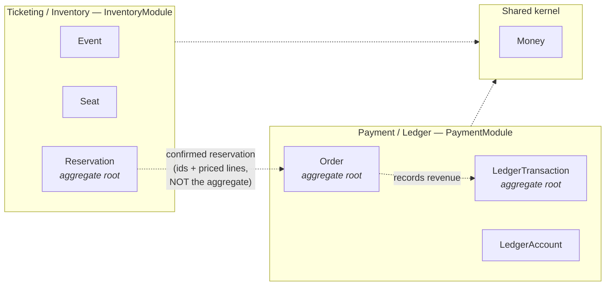
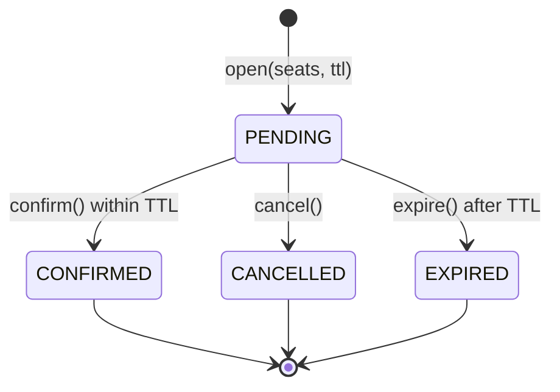
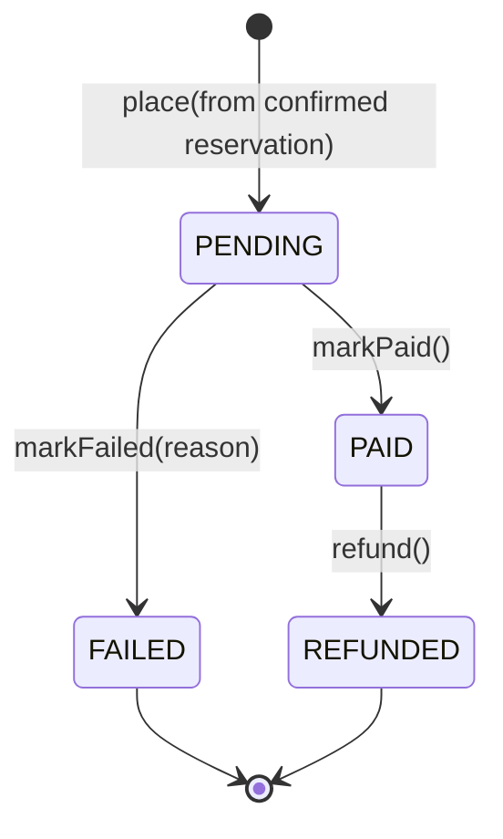

# Domain model

The model the code is built from. Written before the database (TICK-5) on
purpose: the schema should fall out of the model, not the other way round.

Implemented in `apps/api/src/{inventory,payment,shared}/domain/`. Every rule
below is enforced by a test — if this document and the code disagree, the
tests are the truth and this document is a bug.

## Ubiquitous language

Use these words in code, tests, tickets and conversation. Where the code and
this table differ, the code is wrong.

| Term             | Meaning                                   | Not to be confused with  |
| ---------------- | ----------------------------------------- | ------------------------ |
| **Event**        | A performance tickets are sold for        | A domain event / message |
| **Seat**         | One sellable place at an event            | A ticket                 |
| **Hold**         | A temporary, expiring claim on seats      | A purchase               |
| **Reservation**  | The aggregate that owns a hold            | An Order                 |
| **Order**        | What a customer bought and owes for       | A Reservation            |
| **Ledger entry** | One side of a balanced accounting posting | A transaction            |
| **TTL**          | How long a hold survives unconfirmed      | Cache expiry             |

Note "Event" is overloaded in this codebase's wider vocabulary. In the domain
it always means a performance. Messaging concepts, if introduced, will be
called _domain events_ explicitly.

## Bounded contexts

Two contexts, because they change for different reasons and have different
consistency needs. Inventory is contention-heavy and latency-sensitive
(thousands of people racing for the same seat). Payment is money-accurate and
audit-bound. Fusing them would force both to accept the other's constraints.



| Context               | NestJS module       | Owns                                                 | Explicitly does not own        |
| --------------------- | ------------------- | ---------------------------------------------------- | ------------------------------ |
| Ticketing / Inventory | `InventoryModule`   | Event, Seat, Reservation                             | Prices charged, money, refunds |
| Payment / Ledger      | `PaymentModule`     | Order, LedgerAccount, LedgerEntry, LedgerTransaction | Seat availability, holds, TTLs |
| Shared kernel         | `src/shared/domain` | `Money`, `DomainError`                               | Anything context-specific      |

**The contexts do not share aggregates.** Payment never receives a
`Reservation` object. It is handed a reservation _id_ and a list of priced
lines — a published, translated view. This is the seam that lets the hold flow
change without breaking billing, and it is why `Order.place()` takes primitives
and `OrderLine`s rather than a `Reservation`.

`Money` is a genuine shared kernel: both contexts mean exactly the same thing
by it, so duplicating it would be worse than sharing it. It is the only thing
in that category.

## Aggregates

| Aggregate root      | Contains                                             | Key invariants                                                                |
| ------------------- | ---------------------------------------------------- | ----------------------------------------------------------------------------- |
| `Event`             | Identity, sales window                               | Sales close after they open; sales close no later than the event starts       |
| `Seat`              | Identity, event, code, price                         | Code required; price never negative; **no status field**                      |
| `Reservation`       | Identity, event, holder, seat ids, TTL, state        | ≥1 seat; no duplicate seats; legal transitions only; cannot confirm after TTL |
| `Order`             | Identity, reservation id, priced lines, total, state | ≥1 line; no duplicate seats; single currency; legal transitions only          |
| `LedgerTransaction` | ≥2 entries                                           | **Debits equal credits**; non-zero; entries immutable                         |

`Event` deliberately does **not** hold its seats. An arena event has tens of
thousands; loading them all to answer "are sales open?" would make the
aggregate unusable. Seats reference the event by id.

## Seat availability is derived, never stored

`Seat` has no `status` column. `AVAILABLE` / `HELD` / `SOLD` is computed from
whether an active claim references the seat.

The alternative — a `seats.status` column updated as reservations change —
requires writing two places on every transition. Any missed write either
double-books the seat or strands it as permanently unavailable, and expiry
makes it worse: a lapsed hold would need a sweeper to run before the seat
became sellable again.

With the derived model:

| Observed state | Because                                                           |
| -------------- | ----------------------------------------------------------------- |
| `SOLD`         | A `PAID` order line references the seat                           |
| `HELD`         | A `PENDING` reservation that has not passed its TTL references it |
| `AVAILABLE`    | Neither of the above                                              |

Expiry needs no write at all — a hold stops counting the instant its
`expires_at` passes. `Reservation.isExpired(now)` reflects this: a reservation
past its TTL reports expired even though its stored state is still `PENDING`
and no sweeper has touched it. Marking it `EXPIRED` is bookkeeping, not the
thing that releases the seat.

## Reservation state machine

`PENDING` is the only state that holds seats. All three terminal states release
them; they differ in _why_, which matters for reporting and for whether a retry
makes sense.



| From                                    | To          | Trigger        | Guard                           |
| --------------------------------------- | ----------- | -------------- | ------------------------------- |
| —                                       | `PENDING`   | `open()`       | ≥1 seat, no duplicates, TTL > 0 |
| `PENDING`                               | `CONFIRMED` | `confirm(now)` | `now < expiresAt`               |
| `PENDING`                               | `CANCELLED` | `cancel()`     | —                               |
| `PENDING`                               | `EXPIRED`   | `expire(now)`  | `now >= expiresAt`              |
| `CONFIRMED` \| `CANCELLED` \| `EXPIRED` | anything    | any            | **rejected — terminal**         |

Two guards are worth calling out because both are easy to get wrong:

- **`confirm()` after the TTL is refused even if nothing has marked the
  reservation expired.** Expiry is a fact about the clock, not about whether a
  background job has run. Trusting the stored state here would let a slow
  sweeper sell a seat twice.
- **`expire()` before the TTL is refused.** Marking a live hold expired would
  release seats a customer is still legitimately holding.

## Order state machine



| From                   | To         | Trigger              | Guard                                     |
| ---------------------- | ---------- | -------------------- | ----------------------------------------- |
| —                      | `PENDING`  | `place()`            | ≥1 line, no duplicate seats, one currency |
| `PENDING`              | `PAID`     | `markPaid()`         | —                                         |
| `PENDING`              | `FAILED`   | `markFailed(reason)` | reason non-blank                          |
| `PAID`                 | `REFUNDED` | `refund()`           | —                                         |
| `FAILED` \| `REFUNDED` | anything   | any                  | **rejected — terminal**                   |

`refund()` is reachable only from `PAID`. Refunding a `PENDING` or `FAILED`
order would move money that was never captured.

Line prices are **copied** into the order at sale time, not referenced from the
seat catalogue. A later price change must not retroactively alter what a
customer paid.

## The ledger

Double-entry, append-only. Corrections are made by posting a reversing
transaction — entries are never edited, because an editable ledger is not an
audit trail.

Amounts are integer **minor units** (cents). Floating point cannot represent
0.1 exactly, so float sums drift, and a ledger that does not balance to the
cent is worthless.

Entries carry a positive amount plus a `DEBIT`/`CREDIT` direction rather than a
signed amount — direction encodes the sign, so a "negative debit" cannot be
expressed.

A £95 sale with a £5 fee:

| Account        | Type        | Debit | Credit |
| -------------- | ----------- | ----- | ------ |
| Cash           | `ASSET`     | 95.00 |        |
| Ticket revenue | `REVENUE`   |       | 90.00  |
| Fees payable   | `LIABILITY` |       | 5.00   |

`LedgerTransaction.post()` refuses to construct anything where debits ≠ credits,
so an unbalanced transaction cannot exist in memory, let alone reach the
database.

## Invariants the domain cannot enforce

This is the most important section for TICK-5.

> **A seat must not be held or sold by two different reservations.**

This is the system's central rule and **no aggregate can enforce it.** It spans
reservations, and checking "is this seat free?" in application code before
writing is a time-of-check-to-time-of-use race: two concurrent requests both
read _free_, both write, both succeed.

It must be enforced by the database, as a **unique partial index over the seat
id restricted to active claims**, so that the second concurrent writer gets a
constraint violation rather than a double booking. TICK-5 owns building it;
TICK-6 owns proving the query plans.

`Reservation` enforces what genuinely is local to it — at least one seat, no
duplicate seats _within_ itself, and legal transitions — and nothing more.
Pretending it enforces uniqueness across reservations is exactly how this class
of bug ships.

Same category, for TICK-5's attention:

| Invariant                                           | Enforced by                                                 |
| --------------------------------------------------- | ----------------------------------------------------------- |
| A seat is claimed by at most one active reservation | Unique partial index                                        |
| A seat belongs to exactly one event                 | Foreign key                                                 |
| Seat code unique within an event                    | Unique index on `(event_id, code)`                          |
| Order total equals the sum of its lines             | Domain (`Order.place`), recomputed on read                  |
| Ledger transaction balances                         | Domain (`LedgerTransaction.post`) + `CHECK` per transaction |

## Where rules live

```
interface  →  application  →  domain  ←  infrastructure
(HTTP)        (use cases)     (rules)     (Postgres, clocks)
```

- **No business rule in a controller.** Controllers map HTTP onto a use case
  and a domain object onto a response body. If a controller contains an `if`
  about domain state, it is in the wrong place.
- **No business rule in the ORM layer.** The domain classes here have no
  decorators, no base class, and no import from `pg`, an ORM, or `@nestjs/*`.
  TICK-5 adds repositories that _map_ aggregates to rows; mapping is not
  behaviour, and the mapper is not allowed to make decisions.
- **Time is passed in, never read.** Every rule that depends on the clock takes
  `now: Date` as an argument. There is no hidden `Date.now()` in the domain,
  which is why the expiry rules above are testable without faking timers.

The rule is checkable, and this returns nothing:

```bash
grep -rE "from '(@nestjs|typeorm|prisma|drizzle|pg)" apps/api/src/*/domain
```

## What TICK-4 does not decide

Left open deliberately, so the later tickets can choose with real information:

- **Table layout and migration strategy** — TICK-5. This document constrains it
  (derived availability, unique partial index) but does not design it.
- **Index choice and query plans** — TICK-6.
- **How a hold is released in practice** — lazy (queries ignore expired holds)
  versus a sweeper job. The model works with either; the derived-availability
  choice means correctness does not depend on the sweeper running.
- **Idempotency and outbox mechanics** — named in TICK-5's table list, not
  modelled here.
